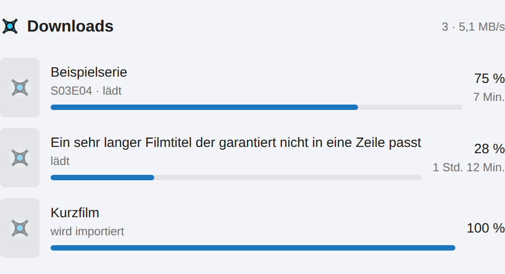
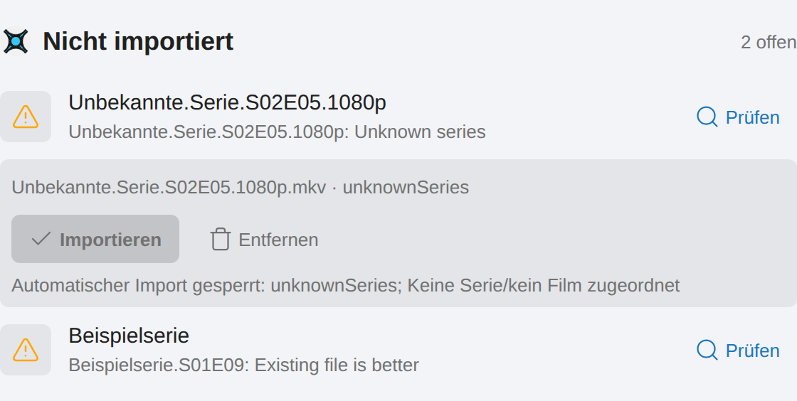
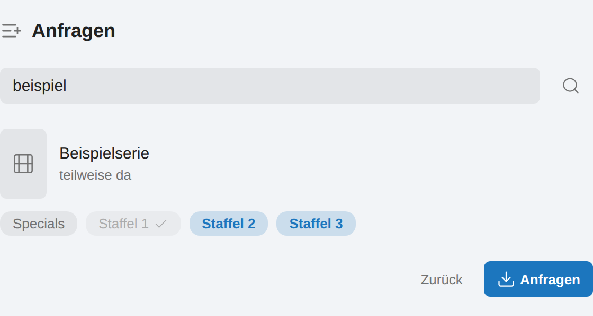
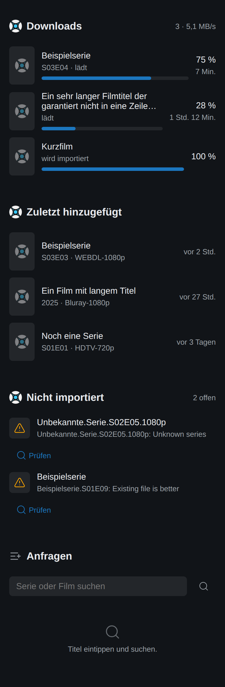

# arrstack Cards

Vier Lovelace-Karten zur Integration
[**arrstack**](https://github.com/luukkii123/ha-arrstack-integrations) —
Radarr, Sonarr, SABnzbd und Jellyseerr/Seerr im Dashboard.



| Karte | Was sie tut |
| --- | --- |
| `arrstack-downloads-card` | Was gerade lädt: Titel, Fortschritt, Status, Restzeit — Sonarr, Radarr oder SABnzbd |
| `arrstack-recent-card` | Zuletzt in die Bibliothek aufgenommen |
| `arrstack-fix-card` | Heruntergeladen, aber nicht importiert — mit Grund und Schnell-Reparatur |
| `arrstack-seer-card` | In Jellyseerr suchen, Staffeln wählen, anfragen |

Jede Karte ist einzeln nutzbar. Wer kein Jellyseerr betreibt, lässt die
Anfrage-Karte weg; wer nur Radarr hat, nimmt die anderen drei.

## Voraussetzung

Die Integration **arrstack** muss eingerichtet sein. Die Karten sprechen nie
direkt mit Radarr, Sonarr, SABnzbd oder Jellyseerr — jeder Aufruf geht über
`hass.callWS` an die Integration, die ihn serverseitig ausführt. Das ist keine
Bequemlichkeit: Jellyseerr setzt keine CORS-Header, der Browser bräche jede
direkte Anfrage ab, und der API-Schlüssel hätte im Browser nichts verloren.

Ohne Integration melden die Karten „Kein passender arrstack-Dienst
eingerichtet."

## Installation

1. In HACS **Custom Repository** hinzufügen: dieses Repo, Kategorie
   **Dashboard**.
2. Installieren, danach den Browser hart neu laden — sonst hängt die alte
   Datei im Cache.
3. Karte auf ein Dashboard legen. Der Karteneditor bietet die eingerichteten
   arrstack-Instanzen zur Auswahl an.

## Einstellungen

| Feld | Bedeutung | Standard |
| --- | --- | --- |
| `title` | Überschrift der Karte | je Karte verschieden |
| `entry_id` | welche Instanz. Leer lassen, wenn es nur eine passende gibt | leer |
| `refresh_seconds` | wie oft neu geladen wird, `0` = nie | 15 (Anfragen: 0) |
| `max_items` | wie viele Zeilen höchstens | 8–10 |
| `show_posters` | Poster in der Download-Karte | `true` |

Gibt es mehrere passende Instanzen und ist keine gewählt, sagt die Karte das
— sie sucht sich keine aus.

```yaml
type: custom:arrstack-downloads-card
title: Downloads
max_items: 5
```

## Reparatur statt Ratespiel



Der Knopf *Importieren* ist nur aktiv, wenn die Integration den Import als
ungefährlich einstuft. Ist eine Datei keiner Serie zugeordnet oder nennt die
App einen heiklen Grund, bleibt er gesperrt und der Grund steht darunter.
*Entfernen* ist bewusst zurückhaltend gestaltet — Löschen ist nie die
Hauptaktion.

## Anfragen mit Staffelauswahl



Bereits verfügbare Staffeln sind gesperrt und markiert, fehlende sind
vorbelegt — der häufigste Wunsch ist „alles, was noch fehlt". Bei Serien geht
die Staffelliste **immer** mit; ohne sie antwortet Jellyseerr mit einem Fehler.

## Mobil und im dunklen Thema



Auf schmalen Karten rutschen die Nebenspalten unter den Inhalt, statt Text
abzuschneiden. Farben kommen aus den Home-Assistant-Variablen, das Thema des
Nutzers gilt also auch hier.

## Das Zeichen des Dienstes

Jede Karte zeigt im Kopf das Logo des Dienstes, auf den sie schaut — Sonarr,
Radarr oder SABnzbd. Fehlt einem Eintrag das Poster, steht das Logo gedämpft
an seiner Stelle statt einer leeren grauen Kachel.

Die Logos werden von **`brands.home-assistant.io`** geladen, Home Assistants
eigener Sammlung: dieselbe Quelle, aus der das Frontend die Zeichen aller
Integrationen holt. Sie liegen also **nicht** in diesem Repo — es sind fremde
Marken. Ohne Internet verschwindet das Bild rückstandslos, die Karte bleibt
vollständig bedienbar.

**Für Jellyseerr gibt es dort kein Zeichen.** Die Adresse antwortet trotzdem
mit HTTP 200 und liefert ein Bild mit der Aufschrift „icon not available" —
am 24.08.2026 nachgemessen: Pixel für Pixel dasselbe wie für einen frei
erfundenen Namen. Ein Statuscode ist hier also kein Beleg. Die Anfrage-Karte
trägt deshalb ein eigenes Strichsymbol; das Zeichen von Overseerr zu borgen
wäre das falsche Produkt.

## Kein Build-Schritt

`dist/arrstack-cards.js` ist Quelltext und Auslieferung in einem: reines
Vanilla-JS mit Custom Elements, kein Bundler, keine Abhängigkeit. **Keine
Unterordner** — eine HACS-Dashboard-Ressource liefert genau eine Datei aus,
alles darunter erreicht den Browser nie.

## Geprüft

Die Bilder oben stammen aus `docs/render/render.py`: Die ausgelieferte Datei
wird in echtem Chromium gerendert, `ha-card`/`ha-icon`/`ha-form` sind
Attrappen, und `callWS` beantwortet die arrstack-Kommandos mit erfundenen
Daten — kein Media-Stack, kein Schlüssel nötig.

```bash
docker run --rm -v "$PWD:/repo" \
  --entrypoint bash mcr.microsoft.com/playwright/python:v1.62.0-noble \
  -c 'pip install --quiet --break-system-packages playwright==1.62.0 >/dev/null; \
      python3 /repo/docs/render/render.py /repo/dist/arrstack-cards.js \
              /repo/docs/render/ergebnis 1280 light'
```

Der Lauf protokolliert jede Netzanfrage nach `report.json` und misst nach, was
sich am Bild sonst nur behaupten ließe: gefüllte Akzentflächen, abgeschnittener
Text, Emoji im Markup, Seitenbreite und ob die Dienst-Logos **tatsächlich
geladen** wurden (`naturalWidth > 0`). Bei 1280 px hell und 390 px dunkel waren
alle Fehlerlisten leer, kein Versuch, aus einem Unterordner nachzuladen, und
die einzige Anfrage nach außen ging an `brands.home-assistant.io`.

**Was noch aussteht:** ein Lauf in einem echten Home Assistant. Geprüft ist die
Darstellung gegen erfundene Daten, nicht das Zusammenspiel mit einem laufenden
Radarr.

## Lizenz

MIT
